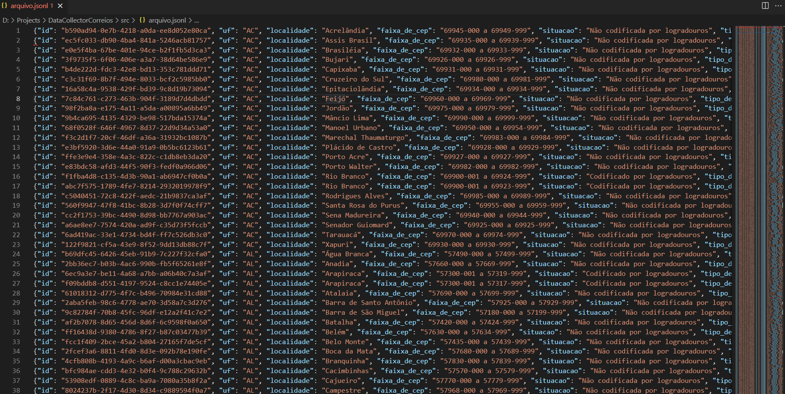

# Data Collector Correios

Neste repositório está a solução para o desafio de coletar dados da url
dos [Correios](http://www.buscacep.correios.com.br/sistemas/buscacep/buscaFaixaCep.cfm). Foram coletados os seguintes
dados com base na busca realizada no site:

* UFs existentes no formulário de busca do site;
* Localidade;
* Faixa de CEP;
* Situação;
* Tipo de faixa de CEP.

Também foram realizados alguns tratamentos durante a coleta de dados:

* Gerado um uuid para cada linha encontrada no site;
* Removidos os itens duplicados de acordo com a faixa de CEP.

## O desafio

* Use a URL https://www2.correios.com.br/sistemas/buscacep/buscaFaixaCep.cfm;
* Obtenha dados de pelo menos duas UFs. Quanto mais melhor;
* Coletar todos os registros de cada UF;
* Cada registro **deve** conter **no mínimo** 3 campos: "localidade", "faixa de cep" e um "id" gerado.
* Não deixe registros duplicados em seu arquivo de saída;
* O formato de saída deve ser [JSONL](http://jsonlines.org)

## Requisitos para execução

* Python 3.10
* Pip (ou outro instalador de pacotes)
* Git

Será necessário o arquivo requirements.txt que possui todas as bibliotecas Python necessárias para a execução do
projeto.

## Bibliotecas utilizadas

* beautifulsoup4 = 4.11.1
* bs4 = 0.0.1
* pip = 21.3.1
* setuptools = 60.2.0
* soupsieve = 2.3.2.post1
* uuid = 1.30
* Wheel = 0.37.1

## Como executar o projeto

Baixar o projeto em um diretório de sua máquina:

```
OBS: Todos os comando abaixo devem ser executados por um terminal do seu Sistema Operacinal
```

* Clone do respositório

    ```
    git clone --branch versao_inicial https://github.com/dwsilva/data_collector_correrios.git
    ```
* Alterar para branch versao_inicial

* Instalar as libs necessárias onde o clone foi realizado:

    ```
    pip install -r requirements.txt
    ```
* Executar o projeto:

    ```
    python main.py

## Saída:

Após a execução do main.py, será craido um arquivo 'arquivo.jsonl' em <diretório do projeto>/src.


Um dos objetivos do desafio é que o arquivo de saída possua a estrutura JSONL que foi gerada conforme abaixo:




    Contato: coutodwsc@gmail.com